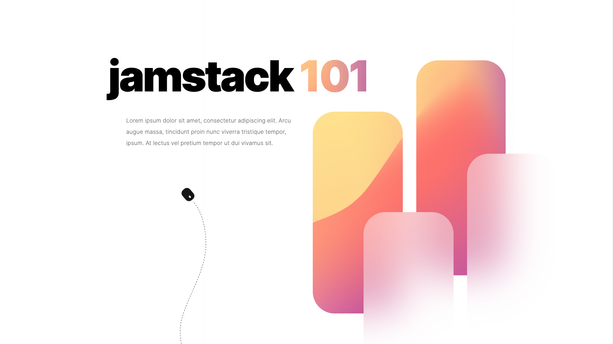
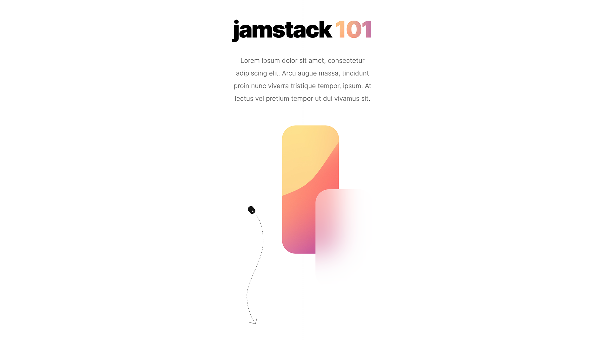

# 🚀 Monogram.io – Front-End Development Exercise

As part of hiring process for [Monogram.io](https://monogram.io/), this is a solution to the Front-End Development Exercise.

---

## 💡 Overview

### The challenge

Create a landing page based on the provided design that includes several sections using the latest technological advancements:

### Minimum expectations

- Deliver by completed due date
- High-quality work
- Clean, concise code
- Comment your HTML and CSS thoroughly
- Responsive design
  - Please interpret the tablet & mobile views on your own. 
  - There is no right or wrong method, but it would be impressive if your final project is fully responsive.
- Animations, CSS-based only! 
  - Do not use a heavy JS animation library like Framer.
- Considering the possibility of adding some 3D effects to one of the elements using Spline, WebGL, or GASP.
- If your deployed site scores amazing on [web.dev](https://web.dev/measure/), we’d be very impressed! 
- Design is property of Monogram

### Screenshots

 
  
  <em>desktop version</em>

 
  
  <em>mobile version</em>

### Links

- Solution URL: [GitHub](https://github.com/jakubjirous/monogram-exercise)
- Live Site URL: [Vercel](https://monogram-exercise-jakubjirous.vercel.app/)

---

## 🎯 My process

### Built with

- [Astro.js](https://astro.build/) – All-in-one web framework
- [Tailwind CSS](https://tailwindcss.com/) – For styles
- [Spline](https://spline.design/) – For 3D design
- [Vercel](https://vercel.com/) – Deployment

### What I learned

- **Spline:**
    - Spline is a fundamental concept in 3D design that plays a crucial role in creating smooth and precise curves.

### Useful resources

- [Astro Documentation](https://docs.astro.build/)
- [Tailwind CSS Documentation](https://tailwindcss.com/docs/installation)
- [Spline Documentation](https://docs.spline.design/)

---

## 👨‍💻 Author

- Website – [www.jakubjirous.cz](https://www.jakubjirous.cz)
- LinkedIn – [jakubjirous](https://www.linkedin.com/in/jakubjirous/)
